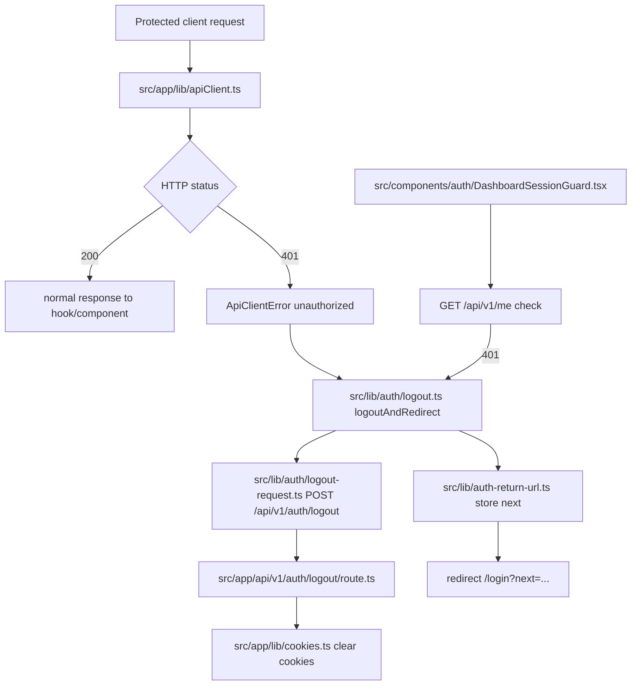

# Code Flow Map (UI -> Hook -> API -> DB)

Related references:
- `../tutorials/new-developer-onboarding.md`
- `key-flows.md`
- `auth-and-security.md`

## Flow A: Protected Dashboard Page Data Load

### Mermaid flow
```mermaid
flowchart TD
  A[Dashboard route /dashboard/**] --> B[src/app/dashboard/layout.tsx requireDashboardAccess]
  B --> C[src/components/AppSidebar.tsx]
  C --> D[src/hooks/useMe.ts + src/hooks/useNavigation.ts]
  D --> E[src/app/lib/api/me.ts + src/app/lib/apiClient.ts]
  E --> F[/api/v1/me + /api/v1/me/navigation]
  F --> G[src/app/lib/guard.ts + src/app/lib/authz.ts]
  G --> H[src/app/db/schema/auth/users.ts]
  G --> I[src/app/db/queries/authz-permissions.ts]
  E --> J{401?}
  J -->|yes| K[src/lib/auth/logout.ts redirect to /login]
```

### File path map
- Starting page/component:
  - `src/app/dashboard/layout.tsx`
  - `src/components/AppSidebar.tsx`
- Hook file path:
  - `src/hooks/useMe.ts`
  - `src/hooks/useNavigation.ts`
- API client file path:
  - `src/app/lib/api/me.ts`
  - `src/app/lib/apiClient.ts`
- API route file path:
  - `src/app/api/v1/me/route.ts`
  - `src/app/api/v1/me/navigation/route.ts`
- DB query/schema path:
  - `src/app/db/schema/auth/users.ts`
  - `src/app/db/queries/authz-permissions.ts`
- Validation/auth files involved:
  - `src/middleware.ts`
  - `src/app/lib/guard.ts`
  - `src/app/lib/authz.ts`
- Error/loading handling:
  - Sidebar uses loading/skeleton states while queries resolve.
  - `apiClient` throws `ApiClientError` for 401 and triggers logout redirect flow.

## Flow B: CRUD Admin Flow (Platoon Management)

### Mermaid flow
```mermaid
flowchart TD
  A[src/app/dashboard/genmgmt/platoon-management/page.tsx] --> B[src/hooks/usePlatoons.ts]
  B --> C[src/app/lib/api/platoonApi.ts]
  C --> D[/api/v1/platoons]
  C --> E[/api/v1/platoons/:idOrKey]
  C --> F[/api/v1/platoons/image/presign]
  D --> G[src/app/lib/validators.ts platoonCreateSchema]
  E --> H[src/app/lib/validators.ts platoonUpdateSchema]
  D --> I[src/app/lib/authz.ts]
  E --> I
  F --> I
  D --> J[src/app/db/schema/auth/platoons.ts]
  E --> J
  E --> K[src/app/db/queries/platoon-commanders.ts]
  D --> L[src/lib/audit.ts withAuditRoute]
  E --> L
  F --> L
```

### File path map
- Starting page/component:
  - `src/app/dashboard/genmgmt/platoon-management/page.tsx`
- Hook file path:
  - `src/hooks/usePlatoons.ts`
- API client file path:
  - `src/app/lib/api/platoonApi.ts`
- API route file path:
  - `src/app/api/v1/platoons/route.ts`
  - `src/app/api/v1/platoons/[idOrKey]/route.ts`
  - `src/app/api/v1/platoons/image/presign/route.ts`
- DB query/schema path:
  - `src/app/db/schema/auth/platoons.ts`
  - `src/app/db/queries/platoon-commanders.ts`
- Validation/auth files involved:
  - `src/app/lib/validators.ts`
  - `src/app/lib/authz.ts`
  - `src/lib/audit.ts`
- Error/loading handling:
  - Page and hook maintain loading states.
  - Mutations and fetch errors surface via toasts and fallback states.

## Flow C: Auth / Logout / 401 Handling

### Mermaid flow


### File path map
- Starting page/component:
  - Any protected component that uses `apiClient`
  - `src/components/auth/DashboardSessionGuard.tsx`
- Hook file path:
  - `src/hooks/useMe.ts`
- API client file path:
  - `src/app/lib/apiClient.ts`
  - `src/lib/auth/logout.ts`
  - `src/lib/auth/logout-request.ts`
  - `src/lib/auth-return-url.ts`
- API route file path:
  - `src/app/api/v1/auth/logout/route.ts`
  - `src/app/api/v1/auth/login/route.ts`
- DB query/schema path:
  - `src/app/db/queries/account-lockout.ts`
  - `src/app/db/queries/appointments.ts`
  - `src/app/db/schema/auth/credentials.ts`
- Validation/auth files involved:
  - `src/middleware.ts`
  - `src/app/lib/cookies.ts`
  - `src/app/lib/jwt.ts`
- Error/loading handling:
  - Unauthorized response creates `ApiClientError` and triggers logout/redirect.
  - Return URL is preserved for post-login navigation.

## Notes for tracing
- API response envelopes are standardized via `src/app/lib/http.ts`.
- Many routes are wrapped with `withAuditRoute` from `src/lib/audit.ts`.
- Action coverage for authorization map is validated by `scripts/validate-action-map.ts`.
