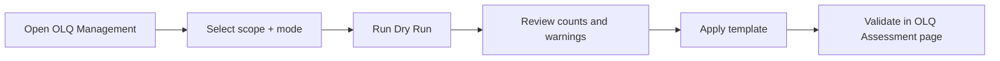

# OLQ Template (Default Profile)

This guide explains how to apply the standard OLQ template and verify it for one course or all active courses.

## 1. Scope {#scope}

- Template is course-level (not separate template per semester).
- The same course template is used by OLQ assessment screens for Term 1 to Term 6.
- Apply options:
- selected course only
- all active courses

## 2. Default template model {#default-template}

- Version: `default.v1`
- Source file: `src/app/lib/olq/default-template.ts`
- Categories and subtitles:

| Category | Default subtitles | Default max marks |
| --- | --- | --- |
| PLG & ORG | Effective Intelligence, Reasoning Ability, Org Ability, Power of Expression | 20 each |
| Social Adjustment | Social Adaptability, Cooperation, Sense of Responsibility | 20 each |
| Social Effectiveness | Initiative, Self-Confidence, Speed of Decision, Ability to Influence the Gp, Liveliness | 20 each |
| Dynamic | Determination, Courage, Stamina | 20 each |

## 3. Apply options {#apply-options}

Open:

- `Dashboard -> Module Mgmt -> OLQ Management`
- In the `Copy Template` tab, use the `Default OLQ Template` panel.

Available options:

- `Scope`:
- `Selected Course`: applies only to the selected course.
- `All Active Courses`: runs for all active courses.
- `Mode`:
- `replace`: deactivates active template rows and inserts default canonical rows.
- `upsert_missing`: creates missing default rows and updates canonical ordering/labels only.
- `Dry Run`: previews exact counts without writing to DB.

Operational API used by this panel:

- `POST /api/v1/admin/olq/templates/apply`

## 4. Validation checklist {#validation-checklist}

After apply:

- Stay on `OLQ Management` and confirm categories/subtitles are present with expected order.
- Open one OC OLQ page:
- `Dashboard -> {OC} -> Mil Mgmt -> OLQ Assessment`
- Confirm categories render correctly for all semester tabs (1 to 6).
- Enter sample marks and save to confirm scoring flow still works.

## 5. Common mistakes {#common-mistakes}

- Running `replace` when you intended to preserve custom categories.
- Skipping dry-run for all-course apply.
- Expecting semester-specific template differences without customizing course template after apply.

