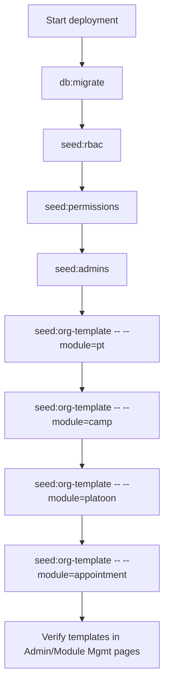

# Org Templates

Use Org Templates to bootstrap default configuration for a new deployment without manually creating each setup row.

## 1. What this does {#what-this-does}

- Applies baseline module configuration (current modules: Physical Training, Camps, OLQ, Appointments, and Platoons).
- Uses non-destructive upsert behavior:
- creates missing default rows
- updates canonical default rows
- keeps extra organization-specific rows untouched
- Supports dry-run preview before applying.

## 2. One-command setup {#one-command-setup}

Run from project root:

```bash
pnpm seed:org-template -- --module=pt
pnpm seed:org-template -- --module=camp
pnpm seed:org-template -- --module=platoon
pnpm seed:org-template -- --module=appointment
```

Preview only (no changes committed):

```bash
pnpm seed:org-template -- --module=pt --dry-run
pnpm seed:org-template -- --module=camp --dry-run
pnpm seed:org-template -- --module=platoon --dry-run
pnpm seed:org-template -- --module=appointment --dry-run
```

## 3. One-click setup from UI {#one-click-ui-setup}

- PT defaults: `Dashboard -> Admin Management -> PT Management -> Template View`.
- Camp defaults: `Dashboard -> Module Mgmt -> Camps Management`.
- Platoon defaults: `Dashboard -> Admin Management -> Platoon Management`.
- Appointment defaults: `Dashboard -> Admin Management -> Appointment Management`.
- OLQ defaults: `Dashboard -> Module Mgmt -> OLQ Management -> Copy Template -> Default OLQ Template`.
- Click `Preview Changes (Dry Run)` first.
- Review summary counts and warnings.
- Click apply action for the target module.

### 3.1 Platoon default template {#platoon-default-template}

- Applies six default platoons: `ARJUN`, `CHANDRAGUPT`, `RANAPRATAP`, `SHIVAJI`, `KARNA`, `PRITHVIRAJ`.
- Upsert behavior:
- creates missing platoons
- updates canonical name/about/theme for matching keys
- restores soft-deleted matching keys
- keeps extra org-specific platoons untouched

### 3.2 Appointment default template {#appointment-default-template}

- Applies default position definitions and username-based active assignments.
- Uses usernames from template payload (for example `comdt_mceme@army.mil`, `dycomdt_mceme@army.mil`, platoon commander usernames).
- For platoon-scoped assignments, matching platoon key must exist first.
- Missing user/platoon does not fail the run; it is returned as a warning.

## 4. Manual fallback path {#manual-fallback}

If you need manual setup:

- PT Types
- Attempts
- Grades
- Tasks
- Score Matrix
- Motivation Awards
- Camps
- Camp Activities
- Platoons
- Appointment Positions
- Appointment Assignments
- OLQ Categories
- OLQ Subtitles

Use this only when organization rules differ from the default baseline.

## 5. Deployment order {#deployment-order}

Recommended fresh-environment sequence:

```bash
pnpm db:migrate
pnpm seed:rbac
pnpm seed:permissions
pnpm seed:admins
pnpm seed:org-template -- --module=pt
pnpm seed:org-template -- --module=camp
pnpm seed:org-template -- --module=platoon
pnpm seed:org-template -- --module=appointment
```

## 6. Troubleshooting {#troubleshooting}

- If dry-run shows large updates unexpectedly, review prior manual PT edits.
- For OLQ, use `upsert_missing` if your organization already has custom categories to keep.
- Appointment template apply skips missing usernames/platoons and reports warnings.
- If action-map validation fails after route changes:
- run `pnpm run validate:action-map`
- If help Mermaid syntax fails:
- run `pnpm run docs:validate:mermaid`


