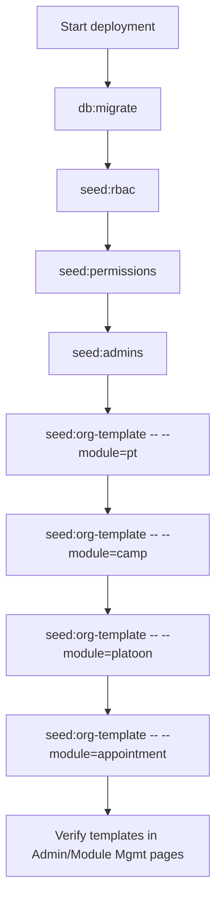

# Org Templates

Use Org Templates to bootstrap default configuration for a new deployment without manually creating each setup row.

## 1. What this does {#what-this-does}

- Applies baseline module configuration (current modules: Physical Training, Camps, OLQ, Appointments, and Platoons).
- Uses non-destructive upsert behavior:
- creates missing default rows
- updates canonical default rows
- keeps extra organization-specific rows untouched
- Supports dry-run preview before applying.

## 2. One-command setup {#one-command-setup}

Run from project root:

```bash
pnpm seed:org-template -- --module=pt
pnpm seed:org-template -- --module=camp
pnpm seed:org-template -- --module=platoon
pnpm seed:org-template -- --module=appointment
```

Preview only (no changes committed):

```bash
pnpm seed:org-template -- --module=pt --dry-run
pnpm seed:org-template -- --module=camp --dry-run
pnpm seed:org-template -- --module=platoon --dry-run
pnpm seed:org-template -- --module=appointment --dry-run
```

## 3. One-click setup from UI {#one-click-ui-setup}

- PT defaults: `Dashboard -> Admin Management -> PT Management -> Template View`.
- Camp defaults: `Dashboard -> Module Mgmt -> Camps Management`.
- Platoon defaults: `Dashboard -> Admin Management -> Platoon Management`.
- Appointment defaults: `Dashboard -> Admin Management -> Appointment Management`.
- OLQ defaults: `Dashboard -> Module Mgmt -> OLQ Management -> Copy Template -> Default OLQ Template`.
- Click `Preview Changes (Dry Run)` first.
- Review summary counts and warnings.
- Click apply action for the target module.

### 3.1 Platoon default template {#platoon-default-template}

- Applies six default platoons: `ARJUN`, `CHANDRAGUPT`, `RANAPRATAP`, `SHIVAJI`, `KARNA`, `PRITHVIRAJ`.
- Upsert behavior:
- creates missing platoons
- updates canonical name/about/theme for matching keys
- restores soft-deleted matching keys
- keeps extra org-specific platoons untouched

### 3.2 Appointment default template {#appointment-default-template}

- Applies default position definitions and username-based active assignments.
- Uses usernames from template payload (for example `comdt_mceme@army.mil`, `dycomdt_mceme@army.mil`, platoon commander usernames).
- For platoon-scoped assignments, matching platoon key must exist first.
- Missing user/platoon does not fail the run; it is returned as a warning.

## 4. Manual fallback path {#manual-fallback}

If you need manual setup:

- PT Types
- Attempts
- Grades
- Tasks
- Score Matrix
- Motivation Awards
- Camps
- Camp Activities
- Platoons
- Appointment Positions
- Appointment Assignments
- OLQ Categories
- OLQ Subtitles

Use this only when organization rules differ from the default baseline.

## 5. Deployment order {#deployment-order}

Recommended fresh-environment sequence:

```bash
pnpm db:migrate
pnpm seed:rbac
pnpm seed:permissions
pnpm seed:admins
pnpm seed:org-template -- --module=pt
pnpm seed:org-template -- --module=camp
pnpm seed:org-template -- --module=platoon
pnpm seed:org-template -- --module=appointment
```

## 6. Troubleshooting {#troubleshooting}

- If dry-run shows large updates unexpectedly, review prior manual PT edits.
- For OLQ, use `upsert_missing` if your organization already has custom categories to keep.
- Appointment template apply skips missing usernames/platoons and reports warnings.
- If action-map validation fails after route changes:
- run `pnpm run validate:action-map`
- If help Mermaid syntax fails:
- run `pnpm run docs:validate:mermaid`



## 7. Detailed Template Behavior Matrix {#detailed-template-behavior-matrix}

Organization templates are bootstrap aids. They are not a replacement for module ownership, role assignment, or production verification.

### 7.1 Template ownership by module

| Template area | Primary page | Data produced | Downstream users |
|---|---|---|---|
| PT | `/dashboard/genmgmt/pt-mgmt` | PT types, attempts, grades, tasks, score rows, motivation fields | PT entry pages, PT reports, bulk PT upload |
| Camps | `/dashboard/genmgmt/camp-management` | Camp definitions and activities | Camp dossier pages and camp score entry |
| Platoons | `/dashboard/genmgmt/platoon-management` | Platoon keys, names, themes, commander-ready structure | OC management, hierarchy, appointment scope |
| Appointment positions | `/dashboard/genmgmt/appointments` | Position definitions and possible assignment targets | RBAC, hierarchy, approvals, setup |
| OLQ | `/dashboard/genmgmt/olq-mgmt` | OLQ categories, subtitles, max marks | OLQ assessment pages and reports |
| Grading policy | `/dashboard/genmgmt/academic-grading-policy` | Grade bands, grade points, formulas | Academic pages and academic reports |

### 7.2 Non-destructive template rules

All default templates must follow these rules:

- Dry-run must be available when the UI exposes apply behavior.
- Existing organization-specific rows must not be deleted silently.
- Missing default rows can be inserted.
- Matching default rows can be updated only on canonical template fields.
- Soft-deleted matching defaults can be restored when that is part of the template contract.
- Warnings must be visible for missing dependencies such as users, platoons, courses, or subjects.
- Operators must verify affected pages after apply.

### 7.3 Dependency order details

Use this dependency order when building a fresh environment:

1. Database migrations create tables and enums.
2. RBAC seed creates roles, permissions, action-map links, and policy state.
3. Admin seed creates users required for setup and operations.
4. Platoon template creates platoon targets.
5. Appointment template creates position definitions and assignments that depend on users and platoons.
6. Course and subject setup creates academic structure.
7. PT, OLQ, camp, and grading templates create module configuration.
8. OC creation or bulk upload assigns OCs into canonical course/platoon/enrollment structure.

If this order is not followed, the apply can still be non-destructive, but warnings may show skipped assignments or missing references.

### 7.4 Template verification evidence

After applying any template, record:

- Target environment and database name.
- Module and template profile.
- Dry-run counts before apply.
- Apply counts after write.
- Warnings and skipped rows.
- Affected page screenshots or notes.
- One downstream workflow that used the generated data.

For example, after PT template apply, validate PT Types, Grades, Tasks, Score Matrix, and Motivation Awards in both template view and normal tab view.

### 7.5 Troubleshooting template drift

| Symptom | Likely cause | Action |
|---|---|---|
| Default rows show in plain tab but not template view | Template query is scoped differently from tab query | Check course/profile/semester filter and template source. |
| Dry-run always shows updates | Manual edits changed canonical default fields | Decide whether the default should win or the organization row should be customized outside template keys. |
| Assignment warnings appear | Referenced user or platoon missing | Create dependency first, rerun dry-run, then apply. |
| OLQ replace removed custom active rows | Replace mode was used | Restore from backup or re-add custom rows, then use upsert_missing next time. |
| Report values did not change after grading update | Recalculation was not applied | Use preview/apply recalculation and verify academic reports. |
