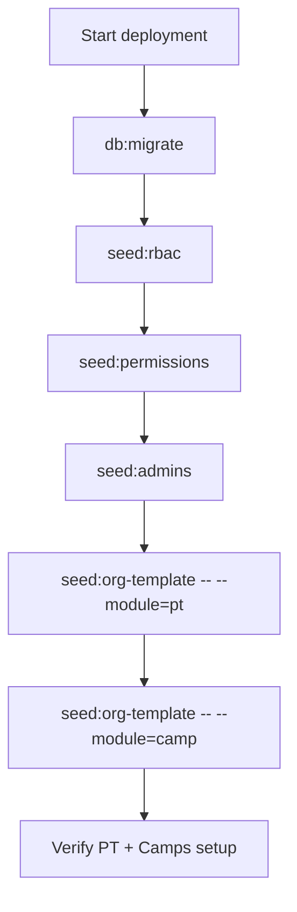

# Org Templates

Use Org Templates to bootstrap default configuration for a new deployment without manually creating each setup row.

## 1. What this does {#what-this-does}

- Applies baseline module configuration (current modules: Physical Training and Camps).
- Uses non-destructive upsert behavior:
- creates missing default rows
- updates canonical default rows
- keeps extra organization-specific rows untouched
- Supports dry-run preview before applying.

## 2. One-command setup {#one-command-setup}

Run from project root:

```bash
pnpm seed:org-template -- --module=pt
pnpm seed:org-template -- --module=camp
```

Preview only (no changes committed):

```bash
pnpm seed:org-template -- --module=pt --dry-run
pnpm seed:org-template -- --module=camp --dry-run
```

## 3. One-click setup from UI {#one-click-ui-setup}

- PT defaults: `Dashboard -> Admin Management -> PT Management -> Template View`.
- Camp defaults: `Dashboard -> Module Mgmt -> Camps Management`.
- Click `Preview Changes (Dry Run)` first.
- Review summary counts and warnings.
- Click apply action for the target module.

## 4. Manual fallback path {#manual-fallback}

If you need manual setup:

- PT Types
- Attempts
- Grades
- Tasks
- Score Matrix
- Motivation Awards
- Camps
- Camp Activities

Use this only when organization rules differ from the default baseline.

## 5. Deployment order {#deployment-order}

Recommended fresh-environment sequence:

```bash
pnpm db:migrate
pnpm seed:rbac
pnpm seed:permissions
pnpm seed:admins
pnpm seed:org-template -- --module=pt
pnpm seed:org-template -- --module=camp
```

## 6. Troubleshooting {#troubleshooting}

- If dry-run shows large updates unexpectedly, review prior manual PT edits.
- If action-map validation fails after route changes:
- run `pnpm run validate:action-map`
- If help Mermaid syntax fails:
- run `pnpm run docs:validate:mermaid`


