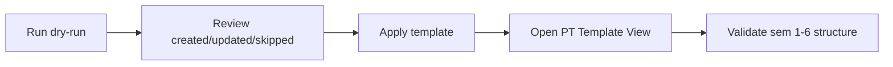

# Physical Training Template (Default Profile)

This guide explains what the default PT org template applies and how to validate it safely.

## 1. Scope {#scope}

- Semester-scoped template baseline for Semesters 1-6.
- Includes:
- PT Types
- Attempts
- Grades
- Tasks
- Task Score Matrix
- Motivation Award Fields

## 2. Default profile model {#default-profile}

- Module: `pt`
- Profile: `default`
- Source file: `src/app/lib/bootstrap/templates/pt/default.v1.json`
- Upsert key strategy:
- `pt_types`: semester + code
- `pt_type_attempts`: ptTypeId + code
- `pt_attempt_grades`: ptAttemptId + code
- `pt_tasks`: ptTypeId + title
- `pt_task_scores`: ptTaskId + ptAttemptId + ptAttemptGradeId
- `pt_motivation_award_fields`: semester + label

## 3. Apply behavior {#apply-behavior}

- No hard delete.
- Missing defaults are inserted.
- Matching defaults are updated on canonical fields (sort, max marks, active flags, labels/titles).
- Extra organization rows remain unchanged.

## 4. Validation checklist {#validation-checklist}

After apply, open PT Management Template View and confirm:

- Semester 1-6 data exists.
- PT type ordering is correct per semester.
- Attempt and grade ordering match template bands.
- Score matrix values are visible per task.
- Motivation fields include:
- Merit Card
- Half Blue
- Blue
- Blazer

## 5. Common operator mistakes {#common-mistakes}

- Applying directly in production without dry-run preview.
- Manual edits done after apply, then expecting rerun to keep non-canonical values.
- Confusing module setup with OC marks entry data (template is config only).

## 6. Detailed PT Template Reference {#detailed-pt-template-reference}

The PT template configures the structure used for PT data entry. It does not create OC PT results by itself.

### 6.1 Data relationship detail

| Table/config concept | Meaning | Validation focus |
|---|---|---|
| PT Type | A semester-scoped PT area or test group | Correct semester, code, title, sort order, active flag. |
| Attempt | A named attempt under a PT Type | Attempts exist for each expected PT Type and are ordered. |
| Grade | Grade band under an attempt | Grade labels, sort order, and score bands are present. |
| Task | Measurable PT task under a PT Type | Task title, max marks, and active state are visible. |
| Task Score Matrix | Score mapping across task, attempt, and grade | Matrix rows exist and render in Score Matrix tab. |
| Motivation Award Field | Award fields such as Merit Card, Half Blue, Blue, Blazer | Fields exist for each expected semester. |

### 6.2 Template view versus tab view

The PT Management page has several tabs. Operators must verify both configuration views:

- `PT Types` confirms high-level type rows.
- `Grades` confirms attempt and grade bands.
- `Tasks` confirms task definitions.
- `Score Matrix` confirms score rows joining task, attempt, and grade.
- `Motivation Awards` confirms award fields.
- Template/default view confirms the applied default profile is visible under the same course/semester scope as the normal tabs.

If normal tabs show defaults but template view does not, the issue is usually query scope, selected course, selected semester, or profile filtering.

### 6.3 Apply and reapply expectations

Safe reapply behavior:

- Reapply should not create duplicate PT Types for the same semester and code.
- Reapply should not create duplicate attempts under the same PT Type and code.
- Reapply should not create duplicate task score rows for the same task, attempt, and grade.
- Reapply may update canonical label/sort/max-mark fields from the default profile.
- Reapply must leave organization-only custom rows intact unless the UI clearly states otherwise.

### 6.4 Downstream impact

PT configuration affects:

- OC PT dossier entry.
- PT bulk upload validation.
- PT assessment report.
- Final performance calculations that read PT score data.
- Motivation award capture.

Changing PT defaults after OCs have PT results requires extra care. Verify an existing OC with PT records and a new OC without PT records.

### 6.5 PT template QA matrix

| Scenario | Expected result |
|---|---|
| Dry-run on empty course/semester | Created counts show missing defaults. |
| Apply on empty course/semester | All default types, attempts, grades, tasks, score rows, and motivation fields are visible. |
| Dry-run immediately after apply | Created counts are zero or only safe updates are reported. |
| Reapply after manual custom row | Custom row remains. |
| OC PT page after apply | PT entry page can select configured tasks and save records. |
| PT bulk upload after apply | Template-backed validation accepts matching PT rows. |
