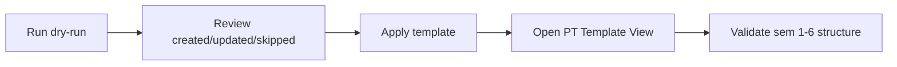

# Physical Training Template (Default Profile)

This guide explains what the default PT org template applies and how to validate it safely.

## 1. Scope {#scope}

- Semester-scoped template baseline for Semesters 1-6.
- Includes:
- PT Types
- Attempts
- Grades
- Tasks
- Task Score Matrix
- Motivation Award Fields

## 2. Default profile model {#default-profile}

- Module: `pt`
- Profile: `default`
- Source file: `src/app/lib/bootstrap/templates/pt/default.v1.json`
- Upsert key strategy:
- `pt_types`: semester + code
- `pt_type_attempts`: ptTypeId + code
- `pt_attempt_grades`: ptAttemptId + code
- `pt_tasks`: ptTypeId + title
- `pt_task_scores`: ptTaskId + ptAttemptId + ptAttemptGradeId
- `pt_motivation_award_fields`: semester + label

## 3. Apply behavior {#apply-behavior}

- No hard delete.
- Missing defaults are inserted.
- Matching defaults are updated on canonical fields (sort, max marks, active flags, labels/titles).
- Extra organization rows remain unchanged.

## 4. Validation checklist {#validation-checklist}

After apply, open PT Management Template View and confirm:

- Semester 1-6 data exists.
- PT type ordering is correct per semester.
- Attempt and grade ordering match template bands.
- Score matrix values are visible per task.
- Motivation fields include:
- Merit Card
- Half Blue
- Blue
- Blazer

## 5. Common operator mistakes {#common-mistakes}

- Applying directly in production without dry-run preview.
- Manual edits done after apply, then expecting rerun to keep non-canonical values.
- Confusing module setup with OC marks entry data (template is config only).

