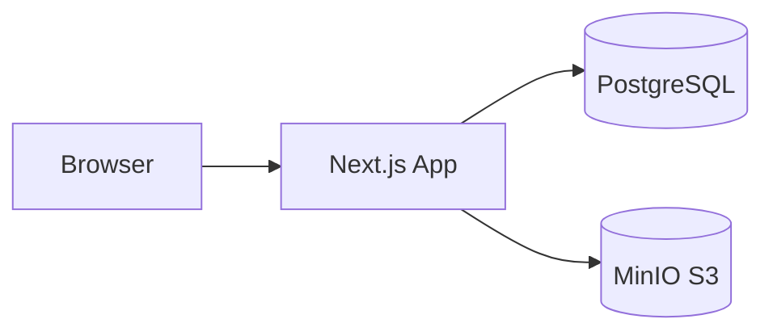
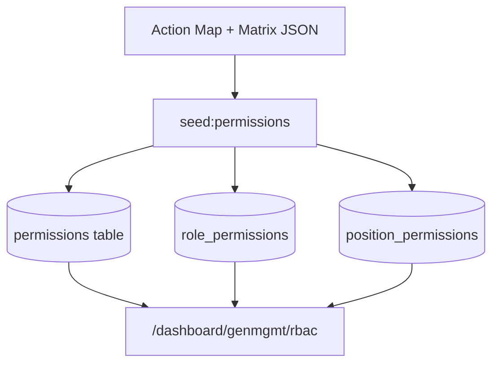
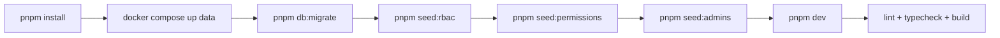

# Setup Guide

This guide is for setting up `e-dossier-v2` on a fresh machine with a new database.

## 1. Prerequisites {#prerequisites}

Required tools:

- Node.js `>=20`
- pnpm `>=9` (repo uses `pnpm@10.25.0`)
- Docker + Docker Compose (for PostgreSQL and MinIO)
- Git

Quick checks:

```bash
node -v
pnpm -v
docker --version
docker compose version
```

## 2. Environment Files {#environment-files}

Create local env file from example and fill secrets:

```bash
cp .env.development.example .env
```

Minimum required values before DB commands:

- `DATABASE_URL`
- MinIO values used by storage code (`S3_*`/bucket values in this repo)

## 3. Start Data Services (Postgres + MinIO) {#start-data-services}

Use the project compose for data services:

```bash
docker compose -f deploy/docker-compose.data.yml --env-file deploy/.env.data up -d
```

Check containers:

```bash
docker compose -f deploy/docker-compose.data.yml --env-file deploy/.env.data ps
```

Mermaid topology:



## 4. Database Migration {#database-migration}

Install dependencies and run migrations:

```bash
pnpm install
pnpm db:migrate
```

Optional DB docs export:

```bash
pnpm db:docs
```

## 5. RBAC Seeding Flow {#rbac-seeding-flow}

Run in this exact sequence:

```bash
pnpm seed:rbac
pnpm seed:permissions
```

What each command does:

- `seed:rbac`: baseline roles/permissions, grants admin/super-admin, ensures SUPER_ADMIN position.
- `seed:permissions`: sync from parsed permission matrix + action-map and updates role/position mappings.

If `seed:permissions` fails with missing matrix file, generate it first:

```bash
pnpm exec tsx scripts/rbac/phase0-generate.ts "/path/to/E Dossier.xlsx"
pnpm seed:permissions
```

RBAC flow diagram:



## 6. Admin Seed {#admin-seed}

Create initial admin user after RBAC seed:

```bash
pnpm seed:admins
```

If you need baseline permissions from spreadsheet import flow, use:

```bash
pnpm seed:permissions
```

## 7. Run and Verify {#run-and-verify}

Start app:

```bash
pnpm dev
```

Quality checks:

```bash
pnpm run validate:action-map
pnpm run lint
pnpm run typecheck
pnpm run build
```

Important note:

- If `pnpm run typecheck` complains about missing `.next/types`, run `pnpm run build` once, then rerun `pnpm run typecheck`.

Fresh setup sequence:



## 8. Common Failures & Fixes {#common-failures}

### 8.1 Missing parsed permission matrix

Symptom:

- `pnpm seed:permissions` says parsed matrix file not found.

Fix:

- Generate matrix with `scripts/rbac/phase0-generate.ts` and rerun `pnpm seed:permissions`.

### 8.2 Frozen lockfile mismatch

Symptom:

- `ERR_PNPM_LOCKFILE_CONFIG_MISMATCH` during CI/local frozen install.

Fix:

- Run `pnpm install --no-frozen-lockfile` once locally, commit updated `pnpm-lock.yaml`.

### 8.3 MinIO bucket or S3 presign errors

Symptom:

- `/api/v1/admin/site-settings/logo/presign` returns 500 with storage error.

Fix:

- Verify MinIO container is up and env keys/bucket names in `.env` match deployed data service config.

### 8.4 Audit warnings for minimatch / transitive deps

Symptom:

- `pnpm audit --audit-level=high` fails.

Fix:

- Align `pnpm.overrides` and lockfile to patched versions, then rerun install and audit.
